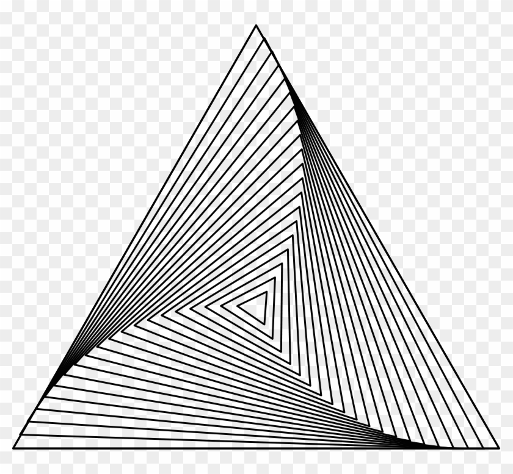

# objetivo
- Recrear y animar la siguiente imagen en Zdog.js


# Resultado final


[Miralo en la web](https://carloscruzvalencia.github.io/3d-triangle-animation-Zdog.js/)
<details open>
<summary>Documentacion del proyecto</summary>

## Mediante un bucle se generan triangulos nesesarios
```JavaScript 
for (i = 0; i != 30; i++) {
    new Zdog.Shape({
        addTo: piramid,
        path: [ // triangle
            { x: i * 0, y: i * -95 },
            { x: i * 90, y: i * 60 },
            { x: i * -90, y: i * 60 },
        ],
        stroke: i * 1.5,
        color: 'gray',
        translate: {
            y: -100,
            z: i*120
        },
        rotate: {
            z: 9.42
        }
    });
}
```

## Para terminar animamos toda la figura
```JavaScript 
function animate() {
    mv = 0.000
    for (i = 0; i != 30; i++) {
        piramid.children[i].rotate.z += mv
        mv = mv + 0.00005
    }
    piramid.updateRenderGraph();
    requestAnimationFrame(animate);
}
animate();
```

# Resultado final


visita la pagina web
[Pagina web](https://carloscruzvalencia.github.io/3d-triangle-animation-Zdog.js/)
</details>
